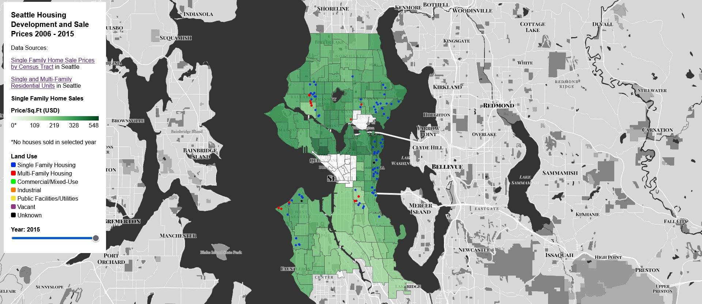
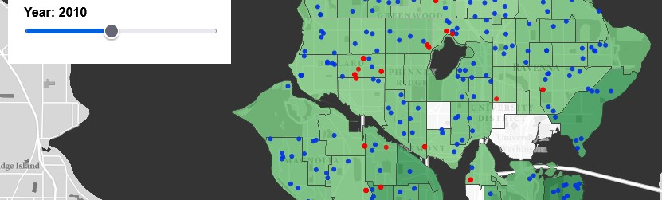
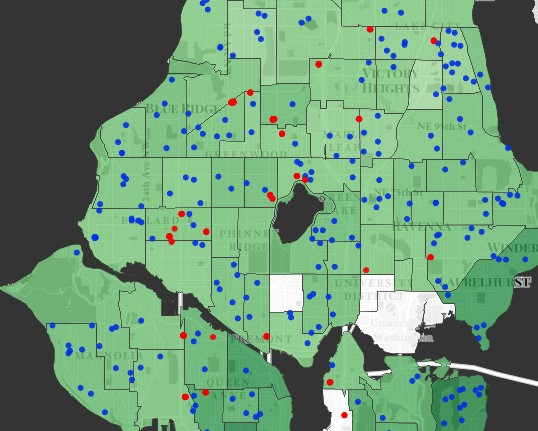
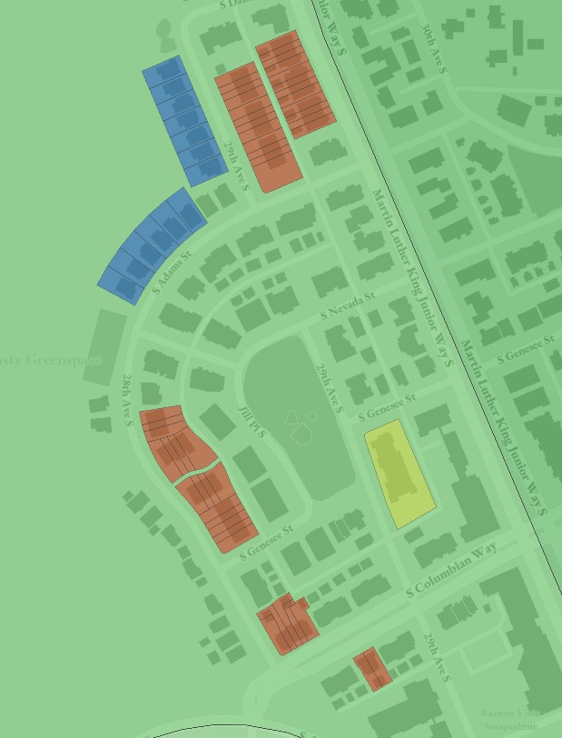
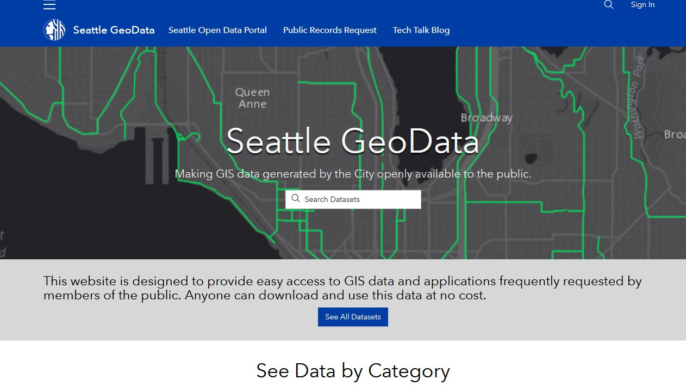

# [Housing Development and Single Family Home Prices in Seattle from 2006-2015](https://kevography.github.io/seattle-development-map/)

## Project Description

This web map was designed to visualize the development of residential land in the city of Seattle alongside the sale prices of single-family housing sold in the specified year within census tracts. The time frame was constrained to 2006-2015 as it was the extent to which the datasets overlapped with 2006 being the lower limit of the sale prices dataset and 2015 being the upper limit of the housing units dataset.

#### Some Data Clarification

Within the dataset there are some variables and factors that require elaboration that would have been too lengthy to place within the web map itself. Additionally this will include choices that were made to better communicate ideas along with explanations of the intention behind those choices.
- Sale prices are based on those **Single-Family** homes that were **sold** within the selected year, they are **NOT** the average prices of all the homes in that census tract for that year. This comes with the caveat that if no single-family homes were sold in that tract for the specified year, it shows up as 0 on the web map. Aspects of housing prices such as the price of rentals or multi-family properties are not included.
- When discussing the year attribute of the residential units dataset, it should be understood as the year construction was *completed* of the unit resting on the site/at the location. A high-contrast base map is used so that the user can further inspect the relation of physical space to properties specified in the dataset.
- Residential units were classified according to their specified land use as specified in the dataset. This has no relation to how the unit is occupied/used or its use at the current moment. This was chosen both to simplify the map/increase legibility and to signal intention on the part of city planners that had an expected use case.
- Price per square foot was chosen as the attribute of analysis for housing sale prices in an effort to normalize the data and account for the effects of various housing sizes on sale price.

## Project Goals

This web map was conceptualized as a way to analyze the relationship between development and home prices within the city of Seattle. For a while now, homelessness has become a topic of rising concern in the Seattle area and it is an issue that has been exacerbated in the context of a global pandemic/public health crisis. Through the course of data source discovery, I narrowed down the scope of my analysis to focus on single-family home ownership; which, while not as directly related to possible solutions to homelessness, does illustrate broader trends of housing and home-buying that affect housing markets and the possibility of home-ownership that have possible implications for homelessness in the city.

Housing units and their construction year was chosen to illustrate changes in housing supply from year to year. These data points were further classified according to their intended land use. This was helpful in allowing the user to also analyze broader trends in development patterns such as a reduction in multi-family residential units constructed in the immediate wake of the 2008 housing crisis . This was chosen as an additional subject of analysis as zoning and land use laws are cities' and local governments' main methods of regulating housing and urban space. These tools directly affect housing supply and demand within the city and are especially important when it comes to home pricing.

#### Application URL: https://kevography.github.io/seattle-development-map/

## Primary Functions
The most important function of this web map is the users' ability to select a year via a slider. Changing the value dynamically changes the data that is displayed on the map. Critically, it ties the changes to both of the main datasets to a single input making it so that the user can easily change with a single control and not match multiple sliders.

Another important function that I implemented was a system that from afar located each construction with a circle that when zoomed in dissolved into the polygon rendering of the properties. This made it easier to locate and read the different developments from afar without sacrificing a more accurate view of the housing units when zoomed in.

### Data Sources

Full data sources (i.e. not constrained to a range of years) were discovered using the [Seattle Open GeoData Portal](https://data-seattlecitygis.opendata.arcgis.com/) on the ArcGIS platform. The full datasets used can be found under [Single Family Home Sale Prices by Census Tract](https://data-seattlecitygis.opendata.arcgis.com/datasets/SeattleCityGIS::single-family-home-sale-prices-by-census-tract) and [Single and Multi-Family Residential Units](https://data-seattlecitygis.opendata.arcgis.com/datasets/single-and-multi-family-residential).

### Applied Libraries
The thematic, data-driven layers and the base map were constructed using Mapbox GL JS and Mapbox Studios respectively. Data and assets are hosted online using the GitHub web services. QGIS was used to compile and process the data to make it web-appropriate by slimming down file sizes. Dr. Bo Zhao of the University of Washington provided the base template for the map.

### Acknowledgements
I first want to acknowledge that by setting this project in Seattle I am documenting land and projects that rest on the tradition lands of the Duwamish People, the first people of Seattle. In documenting land uses and constructing better futures, we have a responsibility to both the land and the people whose land we live on, past and present, and to ensure their voices are included in our imagined futures. I would also like to thank the City of Seattle, without whose data this project would not be possible. Finally, thanks to the Geography 495 teaching team, Bo Zhao, Steven Bao, and the University of Washington whose support made this project possible.
